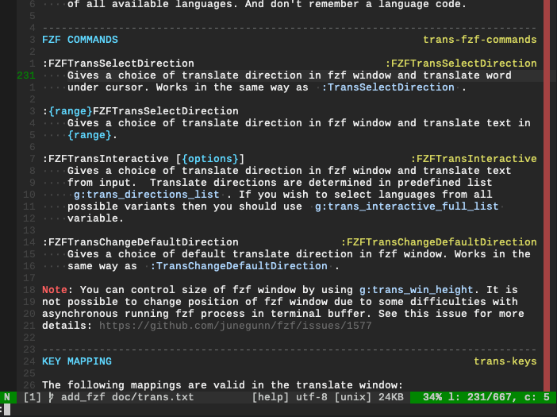

# translate-shell.vim

[](https://travis-ci.org/echuraev/translate-shell.vim)
[](https://codecov.io/gh/echuraev/translate-shell.vim/branch/master)
[](https://github.com/echuraev/translate-shell.vim/blob/master/LICENSE)

## Intro

***Translate-shell.vim*** is a plugin for translating text without leaving Vim. It
provides a window that displays the translate of word under cursor, selected
text or you can use "on fly" translation and translate inserted text. Also,
you can save your translate story to file and import it to [Anki](https://apps.ankiweb.net/).


FZF functions:


## Table of Contents

<!-- vim-markdown-toc GFM -->

* [Features](#features)
* [Requirements](#requirements)
* [Installation](#installation)
    * [Installation with vim-plug](#installation-with-vim-plug)
* [Getting Started](#getting-started)
* [Import history of translating to Anki](#import-history-of-translating-to-anki)
* [TODO List](#todo-list)
* [References](#references)
    * [Author](#author)

<!-- vim-markdown-toc -->

## Features

The following features are supported by translate-shell.vim:

* Translate word under cursor.
* Translate multi line string.
* Select direction of translate from predefined list.
* Interactive translation.
* Open interactive terminal with translate-shell (only **Vim 8**).
* Keep translate history. Choose the better translate to save.
* Download audio for translation.
* Import translation history to Anki.

## Requirements

The following requirements have to be met in order to be able to use
translate-shell.vim:
* Install translate-shell. Translate-shell is used as a backend for the plugin.
  You can find it on [github](https://github.com/soimort/translate-shell).

If you would like to use [FZF](https://github.com/junegunn/fzf) functions that
provided by this plugin, you have to install FZF.  you can find installation
instruction [here](https://github.com/junegunn/fzf.vim#installation).

## Installation

You can install translate-shell.vim by using any vim plugin manager.

### Installation with vim-plug

If you doesn't have installed translate-shell in path, you can install plugin
by the following command:
```vim
Plug 'echuraev/translate-shell.vim', { 'do': 'wget -O ~/.vim/trans git.io/trans && chmod +x ~/.vim/trans' }
```
And after it you should specify path to translate-shell by defining
`g:trans_bin` variable e.g:
```vim
let g:trans_bin = "~/.vim"
```
If you already have installed translate-shell in your PATH then it is enough
to install plugin by the following command:
```vim
Plug 'echuraev/translate-shell.vim'
```

## Getting Started

Translate-shell.vim provides the following commands for translation:
* `:Trans [{options}]` - Translate word under cursor.
* `:'<,'>Trans [{options}]` - Translate text in visual selection.
* `:TransSelectDirection` - Translate word under cursor with selecting translate
    direction.
* `:'<,'>TransSelectDirection` - Translate text in visual selection with
    selecting translate direction.
* `:TransInteractive [{options}]` - Translate inserted text.
* `:TransTerm [{options}]` - Open terminal with interactive translate-shell.
    That works only in Vim 8.
* `:TransOpenHistoryWindow` - Open file with translate history.
* `:TransChangeDefaultDirection` - Change default direction of translating for a
    session.

FZF functions:
* `:FZFTransSelectDirection` - Translate word under cursor with selecting translate
    direction.
* `:'<,'>FZFTransSelectDirection` - Translate text in visual selection with
    selecting translate direction.
* `:FZFTransInteractive` - Translate inserted text.
* `:FZFTransChangeDefaultDirection` - Change default direction of translating
    for a session.

For more convenience, you can create key mapping for these commands e.g:
```
inoremap <silent> <leader>t <ESC>:Trans<CR>
nnoremap <silent> <leader>t :Trans<CR>
vnoremap <silent> <leader>t :Trans<CR>
nnoremap <silent> <leader>td :TransSelectDirection<CR>
vnoremap <silent> <leader>td :TransSelectDirection<CR>
```
Codes of languages you can find [here](https://github.com/soimort/translate-shell#code-list) or run the following command:
```bash
trans -R
```
For more information please look at [doc/trans.txt](doc/trans.txt) or open Vim and run `:h trans`.

## Import history of translating to Anki

You can add history of your translation to Anki and learn new words. Full
information you can find on [wiki](https://github.com/echuraev/translate-shell.vim/wiki/Create-and-import-Anki-cards).

## TODO List
- [x] Keep translate story
    - [x] Choose the better translate to save
- [ ] Nice syntax highlighting
- [ ] Folding for translation on multiple languages
- [x] Possibility to join lines for better translation
- [x] Refactor and join translate functions (visual and not)
- [ ] Async downloading audio for vim 8 (may be for all system calls)
- [ ] Limit on the size of history files

## References

### Author

Egor Churaev egor.churaev@gmail.com

